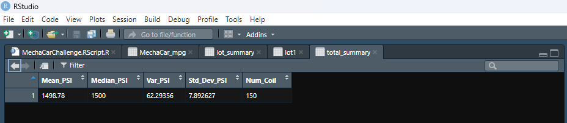
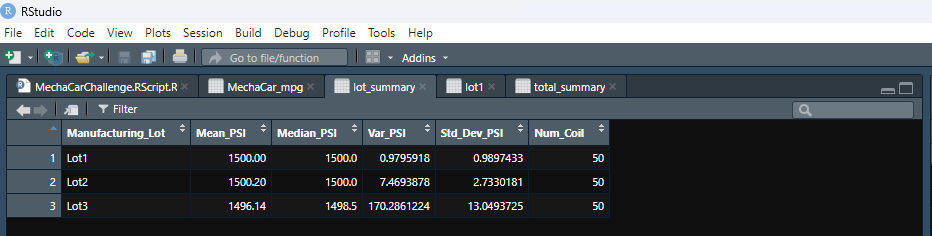
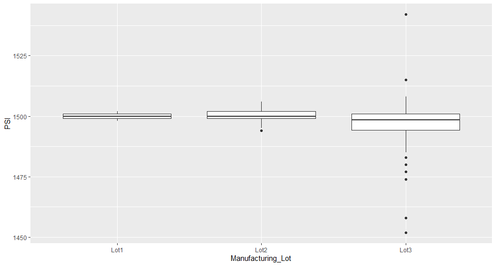

# MechaCar_Statistical_Analysis

## Overview

A few weeks after starting his new role, Jeremy is approached by upper management about a special project. AutosRUs’ newest prototype, the MechaCar, is suffering from production troubles that are blocking the manufacturing team’s progress. AutosRUs’ upper management has called on Jeremy and the data analytics team to review the production data for insights that may help the manufacturing team.

In this challenge, I’ll help Jeremy and the data analytics team do the following:

- Perform multiple linear regression analysis to identify which variables in the dataset predict the mpg of MechaCar prototypes
- Collect summary statistics on the pounds per square inch (PSI) of the suspension coils from the manufacturing lots
- Run t-tests to determine if the manufacturing lots are statistically different from the mean population
- Design a statistical study to compare vehicle performance of the MechaCar vehicles against vehicles from other manufacturers. For each statistical analysis, you’ll - write a summary interpretation of the findings.

## Deliverables:

- Part 1: Linear Regression to Predict MPG
- Part 2: Summary Statistics on Suspension Coils
- Part 3: T-Test on Suspension Coils
- Part 4: Design a Study Comparing the MechaCar to the Competition

## Data and Software:

- Data Source: `MechaCar_mpg.csv` and `Suspension_Coil.csv`
- Data Tools: tidyverse, dplyr, ggplot2 and MechaCarChallenge.RScript.
- Software: RStudio and R

## Part 1: Linear Regression to Predict MPG

**Statistical Summary**

1. The vehicle length, and vehicle ground clearance are statistically likely to provide non-random amounts of variance to the model. That is to say, the vehicle length and vehicle ground clearance have a significant impact on miles per gallon on the MechaCar prototype. Conversely, the vehicle weight, spoiler angle, and All Wheel Drive (AWD) have p-Values that indicate a random amount of variance with the dataset.

2. The p-Value for this model, p-Value: 5.35e-11, is much smaller than the assumed significance level of 0.05%. This indicates there is sufficient evidence to reject our null hypothesis, which further indcates that the slope of this linear model is not zero.

3. This linear model has an r-squared value of 0.7149, which means that approximately 71% of all mpg predictions will be determined by this model. Relatively speaking, his multiple regression model does predict mpg of MechaCar prototypes effectively.

If we remove the less impactful independent variables (vehicle weight, spoiler angle, and All Wheel Drive), the predictability does decrease, but not drastically: the r-squared value falls from 0.7149 to 0.674.

## Part 2: Summary Statistics on Suspension Coils

**Total Summary Dataframe**

The Suspension Coil dataset provided for the MechaCar contains the results of testing the weight capacities of multiple suspension coils from multiple production lots to determine consistency.

**Lot Summary Dataframe**

With the understanding that the design specifications for the MechaCar suspension coils mandate that the variance of the suspension coils cannot exceed 100 pounds per square inch (PSI) .

Does the current manufacturing data meet this design specification for all manufacturing lots in total and each lot individually? Why or why not?

When looking at the entire population of the production lot, the variance of the coils is 62.29 PSI, which is well within the 100 PSI variance requirement.

Similarly, Lot 1 and Lot 2 are well within the 100 PSI variance requirement; with variances of 0.98 and 7.47 respectively. However, it is Lot 3 that is showing much larger variance in performance and consistency, with a variance of 170.29. It is Lot 3 that is disproportionately causing the variance at the full lot level.

## Part 3: T-Test on Suspension Coils

The true mean of the sample is 1498.78, which we also saw in the summary statistics above. With a p-Value of 0.06, which is higher than the common significance level of 0.05, there is NOT enough evidence to support rejecting the null hypothesis. That is to say, the mean of all three of these manufacturing lots is statistically similar to the presumed population mean of 1500.

- Lot 1 sample actually has the true sample mean of 1500. With a p-Value of 1, clearly we cannot reject the null hypothesis that there is no statistical difference between the observed sample mean and the presumed population mean (1500).
- Lot 2 has essentially the same outcome with a sample mean of 1500.02, a p-Value of 0.61; the null hypothesis cannot be rejected, and the sample mean and the population mean of 1500 are statistically similar.
- Lot 3, not surprisingly is a different scenario. Here the sample mean is 1496.14 and the p-Value is 0.04, which is lower than the common significance level of 0.05. All indicating to reject the null hypothesis that this sample mean and the presumed population mean are not statistically different.

**How does this information help?** 

The process in Lot 3's production cycle needs to be checked for system fails and the suspension coils from this lot need to be inspected to remove those not meeting quality criteria.

## Part 4: Design a Study Comparing the MechaCar to the Competition

Metrics
Collecting data for comparable models across all major manufacturers for past 3 years for the following metrics:

- Safety Feature Rating: Independent Variable
- Current Price (Selling): Dependent Variable
- Drive Package : Independent Variable
- Engine (Electric, Hybrid, Gasoline / Conventional): Independent Variable
- Resale Value: Independent Variable
- Average Annual Cost of ownership (Maintenance): Independent Variable
- MPG (Gasoline Efficiency): Independent Variable

**Hypothesis: Null and Alternative**

After determining which factors are key for the MechaCar's genre:

- Null Hypothesis (Ho): MechaCar is priced correctly based on its performance of key factors for its genre.
- Alternative Hypothesis (Ha): MechaCar is NOT priced correctly based on performance of key factors for its genre.

**Statistical Tests**

A multiple linear regression would be used to determine the factors that have the highest correlation/predictability with the list selling price (dependent variable); which combination has the greatest impact on price (it may be all of them!)

